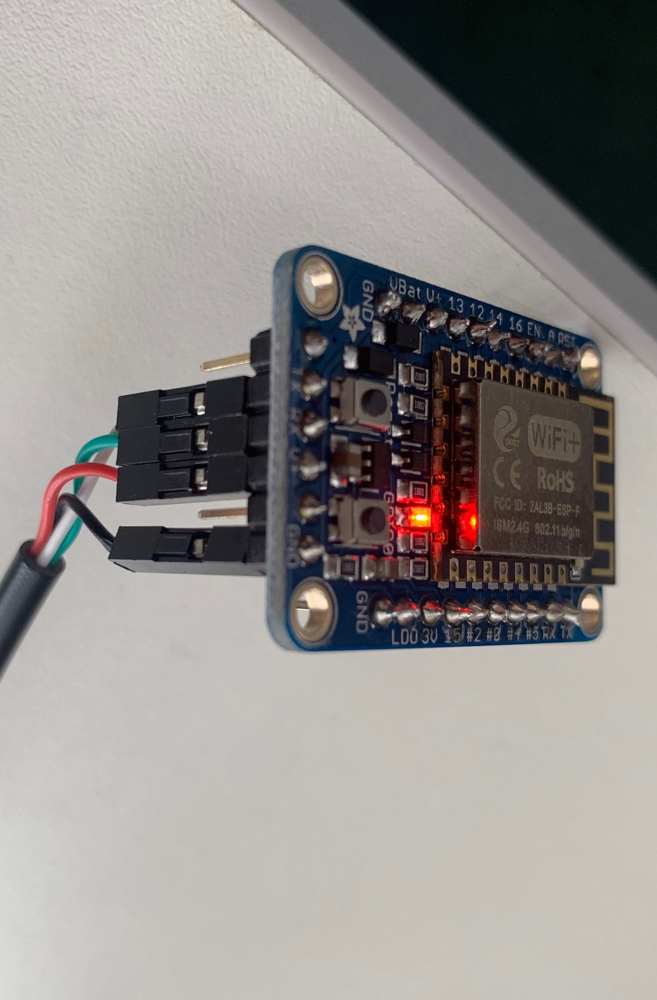
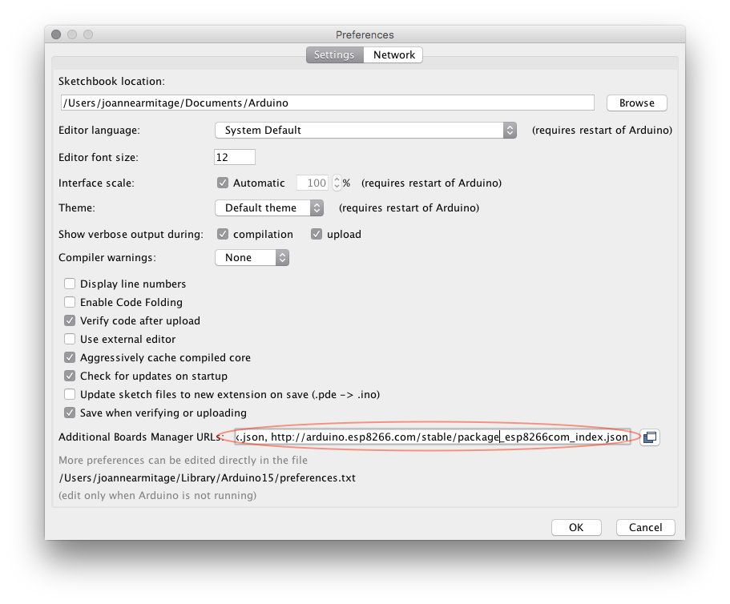

# ESP8266 and Arduino Setup

Below are instructions for setting up an ESP8266, DHT22 sensor and PMS5003 for the AirKit project. The following parts are required:

* [Adafruit Huzzah ESP8266 Breakout](https://learn.adafruit.com/adafruit-huzzah-esp8266-breakout "Adafruit ESP8266 Huzzah")
* [PMS5003](https://shop.pimoroni.com/products/pms5003-particulate-matter-sensor-with-cable "Pimoroni PMS5003")
* [DHT22](https://www.mouser.co.uk/ProductDetail/Seeed-Studio/314010001?qs=sGAEpiMZZMsG1k5vdNM%2FczMiwHVmLeBxy5I1mCdOUxs%3D "Mouser DHT22")
* [USB to TTL Cable](https://thepihut.com/products/adafruit-usb-to-ttl-serial-cable "PiHut USB to TTL")
* Breadboard
* Solder
* Headers
* Molex Converter for prototyping (JA to source)

## Hardware Setup

Solder header pins to the ESP8266 (following Adafruit instrutions). In order to programme the Adafruit Huzzah ESP8266 Breakout it needs to be connected to the computer via a USB to TTL cable. This connects to the header pins at the top of the board (i.e. TX, RX, V+ and GND). The connections are as follows:

| Adafruit Huzzah | TTL Cable       |
| --------------- |:---------------:|
| GND             | Black           |
| V+              | Red             |
| RX              | Green           |
| TX              | White           | 

Connect the USB cable to the computer and install the following.

### DHT22 Sensor

### PMS5003 Sensor

## Software Setup

Install the [Arduino IDE](https://www.arduino.cc/en/main/software "Download Arduino") on your computer.

### ESP8266 Board Package

* Open the 'Preferences' window in the IDE (CMD + , on mac).
* Under the settings menu, navigate to 'Additional Boards Manager URLs' copy and paste the following URL into the box. If you have multiple URLs you can separate them with commas.

