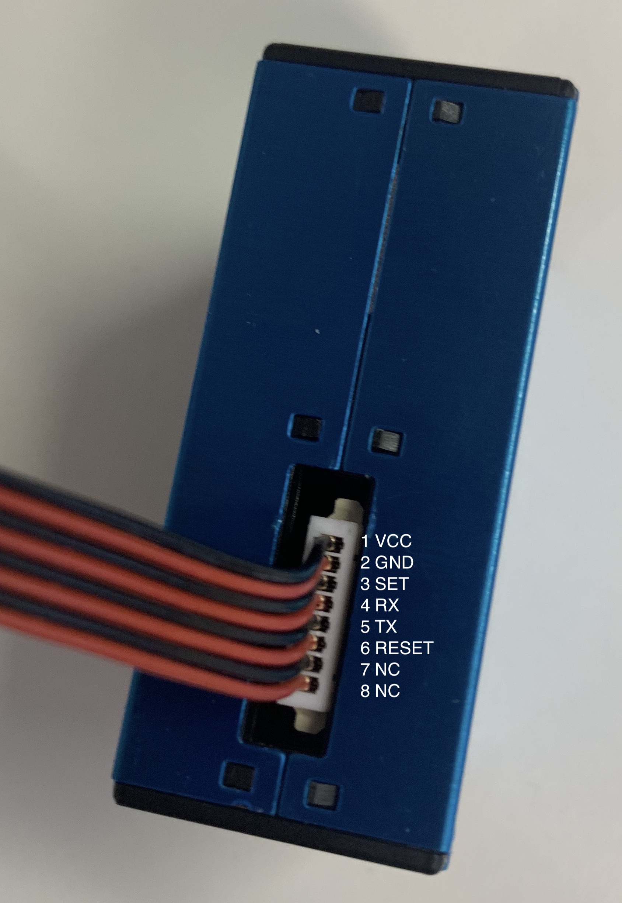

# ESP8266 and Arduino Setup

Below are instructions for setting up an ESP8266, DHT22 sensor and PMS5003 for the AirKit project. The following parts are required:

* [Adafruit Huzzah ESP8266 Breakout](https://learn.adafruit.com/adafruit-huzzah-esp8266-breakout "Adafruit ESP8266 Huzzah")
* [PMS5003](https://shop.pimoroni.com/products/pms5003-particulate-matter-sensor-with-cable "Pimoroni PMS5003")
* [DHT22](https://www.mouser.co.uk/ProductDetail/Seeed-Studio/314010001?qs=sGAEpiMZZMsG1k5vdNM%2FczMiwHVmLeBxy5I1mCdOUxs%3D "Mouser DHT22")
* [USB to TTL Cable](https://thepihut.com/products/adafruit-usb-to-ttl-serial-cable "PiHut USB to TTL")
* Micro USB breakout (add link)
* Micro USB Cable and socket
* Breadboard
* Solder
* Headers
* Molex Converter for prototyping (JA to source)

## Hardware Setup

Solder header pins to the ESP8266 (following Adafruit instrutions). In order to programme the Adafruit Huzzah ESP8266 Breakout it needs to be connected to the computer via a USB to TTL cable. This connects to the header pins at the top of the board (i.e. TX, RX, V+ and GND). The connections are as follows:

| Adafruit Huzzah | TTL Cable       |
| --------------- |:---------------:|
| GND             | Black           |
| V+              | Red             |
| RX              | Green           |
| TX              | White           | 

Connect the USB cable to the computer and install the following.

### DHT22 Sensor

The pins of the DHT22 sensor are as follows. An XXX ohm resistor should be placed between pin 1 and 2.

| Adafruit Huzzah | DHT22           |
| --------------- |:---------------:|
| 3V              | 1 (VCC)         |
| #5              | 2 (DATA)        |
| -               | 3 (NC)          |
| GND             | 4 (GND)         | 

### PMS5003 Sensor

The pins on the PMS5003 are from 1–8 as follows. 

Connect the PMS5003 VCC to V+ which provides 5V the sensor won't have enough power if connected to 3V. Other wires on the PMS5003 are not required.

| Adafruit Huzzah | PMS5003         |
| --------------- |:---------------:|
| V+              | 1 (VCC)         |
| GND             | 2 (GND)         |
| #2              | 4 (RX           |
| #4              | 5 (TX)          | 

### Powering via USB 

## Software Setup

Install the [Arduino IDE](https://www.arduino.cc/en/main/software "Download Arduino") on your computer.

### ESP8266 Board Package

* Open the 'Preferences' window in the IDE (CMD + , on mac).
* Under the settings menu, navigate to 'Additional Boards Manager URLs' copy and paste the following URL into the box. If you have multiple URLs you can separate them with commas. Click OK and return to the main Arduino IDE.
`http://arduino.esp8266.com/stable/package_esp8266com_index.json`

* Navigate to the **boards manager** window via Tools > Board > Boards Manager.. and search for 'ESP8266'.
* Install version **2.5.0** of 'esp8266 by ESP8266 Community'.
* Close the window.

### Connecting the ESP8266 Board

You should now be able to view and select **Adafruit Feather Huzzah ESP8266** from Tools > Board. 
* Set the CPU frequency to 80 MHz. 
* Set the Upload Speed to 115200.
* Set the Port to the correct Serial/COM for the USB to TTL cable.

### Testing and Blinking

[To be completed]

### Adding Required Libraries

Some libraries need to be added to the Arduino to run the code. To add a library to Arduino navigate to Sketch > Include Library > Manage Libraries... Search for and install the following libraries:
* **WiFiManager** by tzapu Version 0.14.0
* **DHT sensor** library by Adafruit Version 1.3.7
* **ThingSpeak** by MathWorks Version 1.5.0
* **PMS Library** bt Mariusz Kacki 1.1.0 (double check this JA)
* NB Ticker library?

### Uploading Code

